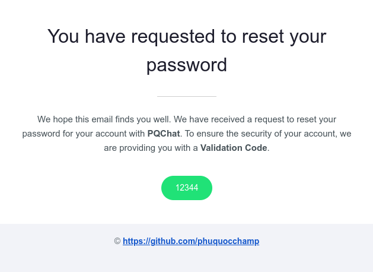
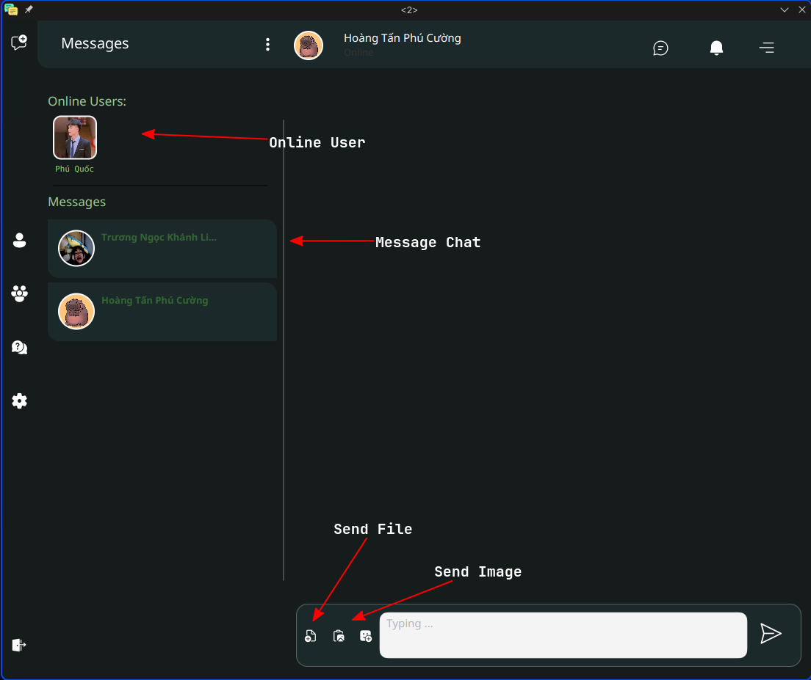

# PQChat - Chatting Application

PQChat is a client-to-client messaging application developed using JavaFX, CSS, Socket programming, and File I/O. It allows users to send text messages, images, and files between individual clients as well as within group chats.

## Contain

### Server Side

- [Link](https://github.com/phuquocchamp/PQChat-Server)

### Client Side

- [Link](https://github.com/phuquocchamp/PQChat-Client)

## Features

- **Instant Messaging:** Send and receive real-time text messages between individual clients.
- **Image Sharing:** Share images with other clients by uploading and viewing them within the chat interface.
- **File Transfer:** Send and receive files of various formats directly through the application.
- **Group Chats:** Create and participate in group chats to communicate with multiple clients simultaneously.
- **User-Friendly Interface:** Enjoy a visually appealing and intuitive user interface built with JavaFX and CSS.

## Demo

### Login Scene

#### Login

#### Register Account

#### Forget Account

##### Send validation code via email

### Client Scene

#### Client 

#### Send Image

### Group Sence

### ChatBot [using ChatGPT API]

## Technologies Used

PQChat is built using the following technologies:

- **JavaFX:** A platform for creating desktop applications with rich graphical user interfaces.
- **CSS:** Cascading Style Sheets for styling the user interface.
- **Socket Programming:** TCP/IP socket programming for establishing communication channels between clients.
- **File I/O:** Reading and writing files for handling file transfers.

## License

PQChat is licensed under the [phuquocchamp](phuquocchamp).
